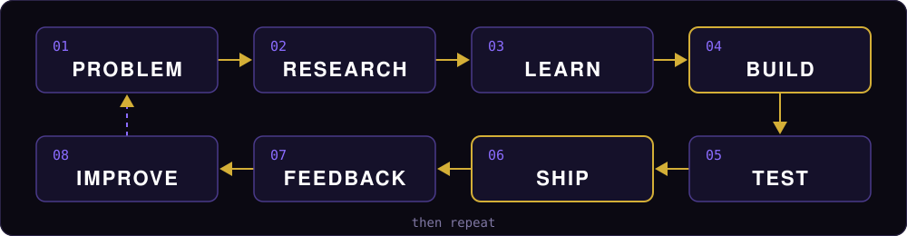
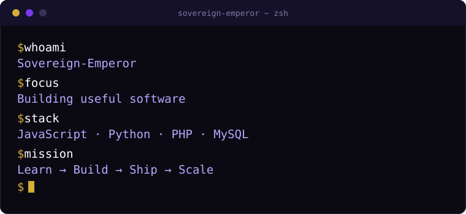

<!--
  SOVEREIGN EMPEROR — GitHub Profile README
  Repo: Sovereign-Emperor/Sovereign-Emperor  
-->

<!-- HERO -->

  

  

<!-- NAVIGATION -->

  
  
  
  
  

 

<!-- ABOUT -->

## 👑 About

I'm a **Computer Science student**, working toward becoming a strong software engineer and a builder of useful technology.

I learn by **building**: practical software, experiments, and ideas turned into working projects. Right now I'm strengthening my foundations in web development, programming, databases and software engineering, while exploring the path toward full-stack development and AI-powered applications.

<!-- CURRENT FOCUS -->
<table>
  <tr>
    <td width="150"><b>🔭 BUILDING</b></td>
    <td>Real-world software projects and experiments</td>
  </tr>
  <tr>
    <td><b>🌱 LEARNING</b></td>
    <td>JavaScript • Python • React • Backend • Databases</td>
  </tr>
  <tr>
    <td><b>🧠 EXPLORING</b></td>
    <td>AI/ML • Full-stack development • Software architecture</td>
  </tr>
  <tr>
    <td><b>🎯 FOCUS</b></td>
    <td>Turning technical skills into useful products</td>
  </tr>
  <tr>
    <td><b>🚀 LONG-TERM</b></td>
    <td>Technology + Entrepreneurship + Ownership</td>
  </tr>
</table>

<!-- TECH STACK -->

## ⚡ Tech Stack

> A direction, not a trophy case. Labels show where I actually am with each tool.

<table>
  <tr>
    <td width="130"><b>Frontend</b></td>
    <td></td>
    <td>HTML · CSS · JavaScript: <b>building with</b> React: <b>learning</b></td>
  </tr>
  <tr>
    <td><b>Backend</b></td>
    <td></td>
    <td>Python · PHP: <b>building with</b> Node.js: <b>exploring</b></td>
  </tr>
  <tr>
    <td><b>Database</b></td>
    <td></td>
    <td>MySQL: <b>building with</b> PostgreSQL: <b>learning / next</b></td>
  </tr>
  <tr>
    <td><b>Tools</b></td>
    <td></td>
    <td>Git · GitHub: <b>building with</b> Linux: <b>exploring</b></td>
  </tr>
  <tr>
    <td><b>AI</b></td>
    <td></td>
    <td>Python · AI APIs · Machine Learning: <b>exploring / learning</b></td>
  </tr>
</table>

<!-- HOW I BUILD -->
## ⚡ How I Build

  

> *I don't want to learn technology without a destination. Projects give my learning a purpose.*

<!-- TERMINAL -->

  

<!-- FEATURED PROJECTS -->

## 🚀 Featured Projects

<!-- <table>
  <tr>
    <td width="50%" valign="top">
      <h3>👑 Sovereign Empire</h3>
      
A long-term technology/business vision exploring digital commerce, local vendors, digital storefronts, payments, and tools that help businesses participate more effectively in the digital economy.

      
<code>Digital commerce</code> <code>Storefronts</code> <code>Payments</code>

      
<b>Status:</b> 🚧 Concept / Development

      
<a href="YOUR_REPOSITORY_LINK">View repository →</a>

    </td>
    <td width="50%" valign="top">
      <h3>🌐 Personal Developer Portfolio</h3>
      
My personal developer portfolio for showcasing projects, technical skills, experiments and contact information.

      
<code>HTML</code> <code>CSS</code> <code>JavaScript</code>

      
<b>Status:</b> 🚧 Building

      
<a href="YOUR_REPOSITORY_LINK">View repository →</a>

    </td>
  </tr>
  <tr>
    <td width="50%" valign="top">
      <h3>💻 JavaScript Projects</h3>
      
Small practical projects used to strengthen JavaScript fundamentals and frontend development.

      
<code>JavaScript</code> <code>Frontend</code>

      
<b>Status:</b> 🧪 Learning / Building

      
<a href="YOUR_REPOSITORY_LINK">View repository →</a>

    </td>
    <td width="50%" valign="top">
      <h3>🐍 Python Projects</h3>
      
Programming experiments and practical projects used to strengthen Python and computational thinking.

      
<code>Python</code> <code>Problem solving</code>

      
<b>Status:</b> 🧪 Learning / Building

      
<a href="YOUR_REPOSITORY_LINK">View repository →</a>

    </td>
  </tr>
</table> -->

<!-- PROJECT SOVEREIGN -->
## 👑 Project Sovereign

My personal framework for becoming a stronger builder and entrepreneur.

**LEARN** → **BUILD** → **VALIDATE** → **SHIP** → **EARN** → **SCALE** → **OWN**

> *Find real problems. Build useful solutions. Get them into the hands of real people.*

**Long-term vision.** Sovereign Empire represents my broader ambition to combine technology, entrepreneurship and product building. Areas I'm exploring (none are existing businesses): digital commerce, software products, AI, financial technology, education, digital platforms, and African technology markets.

<!-- LEARNING ROADMAP -->

## 🧭 Learning Roadmap

> A direction, not a claim that every item is mastered.

<table>
  <tr>
    <td width="60" align="center"><b>01</b></td>
    <td width="170"><b>FOUNDATIONS</b></td>
    <td>HTML · CSS · JavaScript · Git/GitHub · Programming fundamentals · Databases</td>
  </tr>
  <tr>
    <td align="center"><b>02</b></td>
    <td><b>MODERN WEB</b></td>
    <td>React · TypeScript · APIs · Backend development · Authentication · PostgreSQL</td>
  </tr>
  <tr>
    <td align="center"><b>03</b></td>
    <td><b>ENGINEERING</b></td>
    <td>Data structures · Algorithms · Architecture · Testing · Security · Linux · Docker · Deployment</td>
  </tr>
  <tr>
    <td align="center"><b>04</b></td>
    <td><b>AI</b></td>
    <td>Python · AI APIs · LLMs · Automation · Machine Learning · AI-powered applications</td>
  </tr>
  <tr>
    <td align="center"><b>05</b></td>
    <td><b>BUILD 👑</b></td>
    <td>Real users · Real products · Real problems · Real revenue</td>
  </tr>
</table>

<!-- GITHUB STATS -->
## 📊 GitHub Activity

  
  
    
  

<!-- SOCIAL LINKS / CONNECT -->

## 🤝 Connect

**Have an idea, project, or interesting problem? Let's build something useful.**

  
  
  
  
  
  
  <!-- OPTIONAL: uncomment the ones i'll actually use
  
  
  -->

<!-- FOOTER -->
 

  Learn → Build → Validate → Ship → Improve → Repeat 
  

